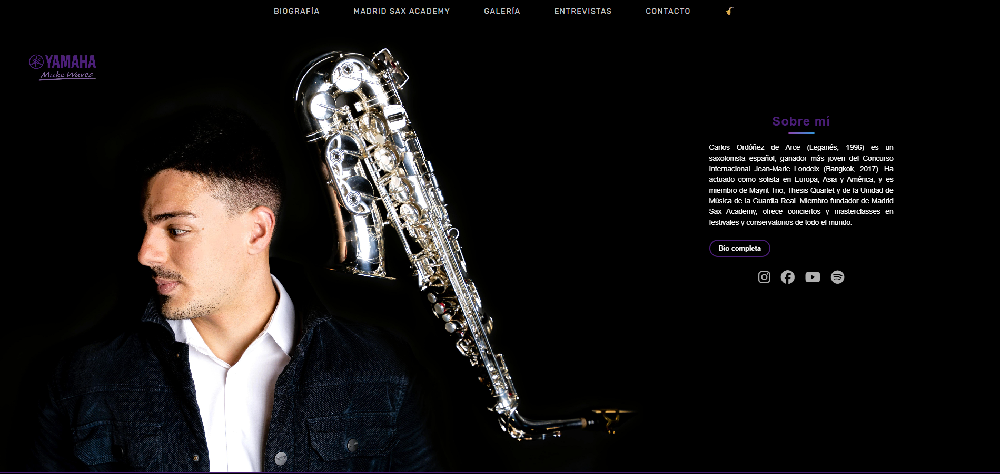

# web_carlos

Proyecto web PHP MVC para la pagina publica y el panel de administracion de Carlos Ordonez.

## Estado

- Web publica con secciones dinamicas.
- Panel de administracion con login.
- Gestion de entradas por seccion.
- CRUD de Agenda implementado.
- Preparado para subir directamente a `htdocs/` en InfinityFree.

## Vista previa



## Repositorio Git

Repositorio correcto:

```bash
git clone https://github.com/lauraordo93/web_carlos.git
```

Carpeta esperada del proyecto:

```text
web_carlos
```

## Estructura principal

```text
web_carlos/
|-- index.php
|-- .htaccess
|-- .env
|-- app/
|-- css/
|-- js/
|-- img/
|-- doc/
|-- README.md
\-- guia.md
```

## Ejecucion local

Colocar el proyecto en:

```text
C:\xampp\htdocs\web_carlos
```

Abrir en el navegador:

```text
http://localhost/web_carlos/
```

No se ejecuta abriendo un `index.html`; el punto de entrada correcto es `index.php`.

## Agenda

La seccion Agenda esta conectada a base de datos.

- Publico: muestra proximos eventos y eventos anteriores.
- Admin: permite listar, crear, editar y borrar eventos.
- Fecha de hoy y futuras: aparecen en "Proximos eventos".
- Fechas pasadas: aparecen en "Eventos anteriores".

Rutas admin:

```text
/admin/agenda
/admin/agendaNueva
/admin/agendaEditar/{id}
/admin/agendaBorrar/{id}
```

## Base de datos

La tabla `agenda` debe tener `id` como clave primaria autoincremental:

```sql
ALTER TABLE agenda
MODIFY id int(11) NOT NULL AUTO_INCREMENT,
ADD PRIMARY KEY (id);
```

Si `id` ya es clave primaria:

```sql
ALTER TABLE agenda
MODIFY id int(11) NOT NULL AUTO_INCREMENT;
```

## Despliegue en InfinityFree

Subir el contenido de esta carpeta directamente dentro de `htdocs/`.

Comprobar:

- `.htaccess` en la raiz.
- `index.php` en la raiz.
- Carpetas `css/`, `js/`, `img/` y `doc/` en minusculas.
- `.env` con credenciales reales de InfinityFree.
- Tabla `agenda` corregida con `AUTO_INCREMENT`.

Mas detalles en `guia.md`.
